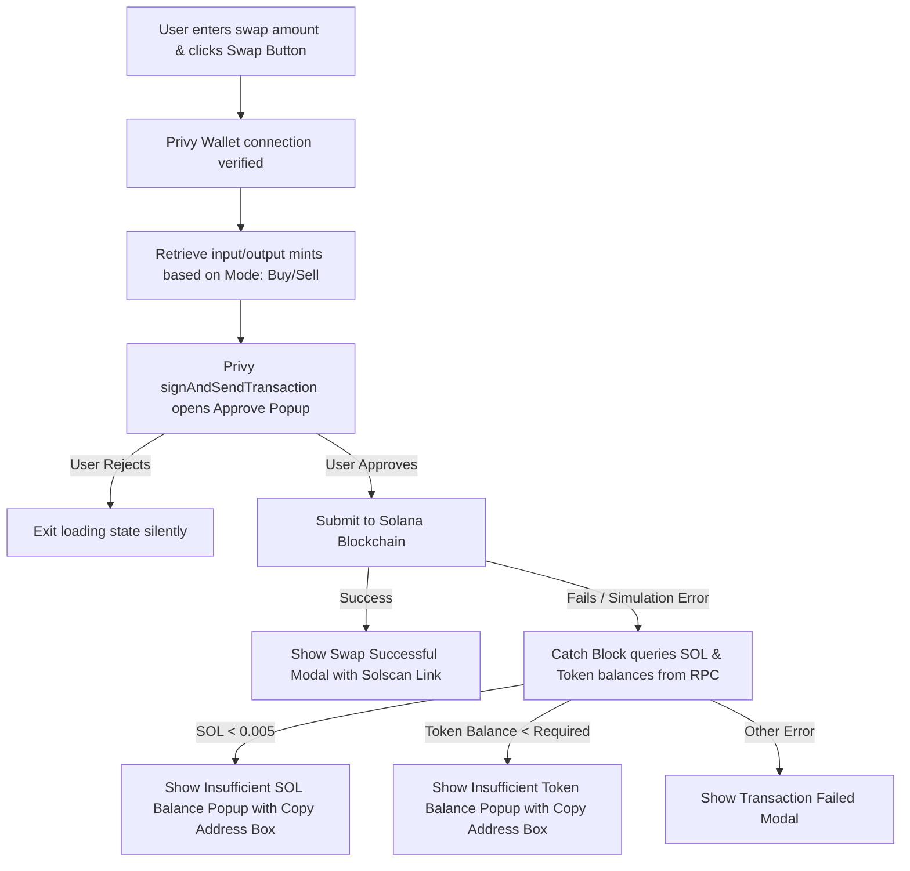

# 🐸 ChadWallet

ChadWallet is a premium, high-performance web dashboard for trading trending Solana tokens and discovering the next 100x memecoins. It integrates real-time charting, live on-chain trade feeds, social embedded wallet creation, and instant slippage-controlled token swapping.

---

## ✨ Key Features

*   **Social Sign-In Embedded Wallets:** Powered by **Privy**, allowing users to instantly provision a fully functional Solana wallet via Google or Apple sign-in without needing any browser extensions (e.g., Phantom).
*   **Mainnet Swap Routing via Jupiter:** Executes token swaps using the **Jupiter Swap API v1**. Swaps are requested as **Legacy Transactions** (`asLegacyTransaction: true`) to bypass Address Lookup Table (ALT) parsing conflicts in embedded browser wallets.
*   **Live Balance Polling:** Polling mechanisms query the RPC node (via Alchemy) every 15 seconds to update the user's live SOL and selected token balances directly in the UI.
*   **Custom Status Modal Overlays:** Custom UX for transaction outcomes:
    *   **Swap Success Modal:** Displays a green checkmark and links the user directly to Solscan to view their transaction hash.
    *   **Insufficient Balance Overlays:** Triggers a popup post-approval if the user doesn't have enough SOL (requires at least `0.005 SOL` for gas) or the selected token. Includes a one-click wallet address copy box for immediate funding.
    *   **User Rejection Handling:** Detects when the user cancels or rejects the Privy approval popup and exits the loading state silently.
*   **Trading Protections:** Built-in safeguards (e.g., client-side checks for self-swaps like SOL-to-SOL) prevent redundant network traffic and clear warning popups.
*   **Interactive Candlestick Charting:** Powered by TradingView's `@lightweight-charts`, rendering real-time price changes and dynamic indicator markers (`+`, `-`, `👤`, `⭐`) on buy/sell and top trader events.
*   **Clean Production Builds:** Fully typed and optimized for Next.js App Router (Turbopack) and deployable to platforms like Vercel out of the box.

---

## 🛠️ Tech Stack

*   **Framework:** Next.js 16 (Turbopack) with App Router.
*   **Styling:** Tailwind CSS & Glassmorphism design system.
*   **Authentication & Wallet:** Privy Solana SDK (`@privy-io/react-auth` + `@privy-io/react-auth/solana`).
*   **On-Chain Swap Engine:** Jupiter Swap API.
*   **Blockchain RPC:** Alchemy Solana Mainnet RPC node.
*   **Data Aggregator:** BirdEye Data API (trending tokens, price history, search, and live trades).
*   **Charts:** Financial candlestick plotting via `lightweight-charts`.

---

## 🚀 Getting Started & Local Setup

### 1. Prerequisites
Make sure you have Node.js (v18+) and npm (or `bun` / `pnpm` / `yarn`) installed.

### 2. Clone and Install Dependencies
Install all package dependencies:
```bash
npm install
```

### 3. Configure Environment Variables
Create a `.env.local` file in the root directory and configure the following variables:
```env
# Privy Configurations
NEXT_PUBLIC_PRIVY_APP_ID=your_privy_app_id_here

# Solana RPC Node (Alchemy suggested to bypass rate-limiting and CORS blocks)
NEXT_PUBLIC_ALCHEMY_RPC_URL=https://solana-mainnet.g.alchemy.com/v2/your_alchemy_api_key_here

# BirdEye API Configurations (Required for real-time lists and chart routes)
BIRDEYE_API_KEY=your_birdeye_api_key_here
```

### 4. Run the Development Server
Launch the local server:
```bash
npm run dev
```
Open [http://localhost:3000](http://localhost:3000) in your browser to view the application.

### 5. Build for Production
To perform TypeScript checks and output an optimized production bundle:
```bash
npm run build
```

---

## ⚙️ How It Works (Architecture)

### Swap Flow Lifecycle


### Route Index
- `/` - Landing page displaying features, stats, and call-to-actions.
- `/trade` - Trading interface loading trending tokens.
- `/trade/[address]` - Deep-linkable trading screen targeting a specific token address.
- `/api/tokens` - Server-side proxy fetching trending Solana token data from BirdEye.
- `/api/history` - Server-side proxy fetching price history for charts.
- `/api/search` - Server-side proxy facilitating token queries.
