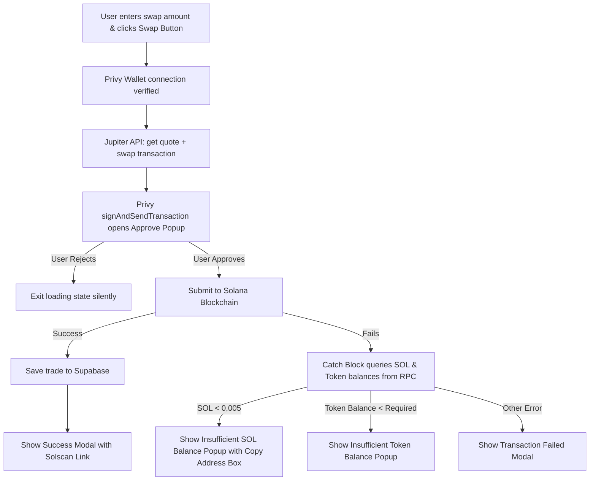

# 🐸 ChadWallet

ChadWallet is a premium, high-performance web dashboard for trading trending Solana tokens and discovering the next 100x memecoins. It integrates real-time charting, live on-chain trade feeds, social embedded wallet creation, and instant slippage-controlled token swapping — with full **Supabase persistence** and **mobile-responsive** layout.

---

## ✨ Key Features

*   **Social Sign-In Embedded Wallets:** Powered by **Privy**, allowing users to instantly provision a fully functional Solana wallet via Google or Apple sign-in without needing any browser extensions (e.g., Phantom).
*   **Mainnet Swap Routing via Jupiter:** Executes token swaps using the **Jupiter Swap API v1**. Swaps are requested as **Legacy Transactions** (`asLegacyTransaction: true`) to bypass Address Lookup Table (ALT) parsing conflicts in embedded browser wallets.
*   **Live Balance Polling:** Polling mechanisms query the RPC node every 15 seconds to update the user's live SOL and selected token balances directly in the UI.
*   **Custom Status Modal Overlays:** Custom UX for transaction outcomes — success modals with Solscan links, insufficient balance popups with one-click wallet address copy, and silent rejection handling.
*   **Portfolio Dashboard:** Holdings (on-chain balances + P&L) and History (chronological trade list) tabs, persisted to Supabase with localStorage fallback.
*   **Interactive Candlestick Charting:** Powered by TradingView's `lightweight-charts`, rendering real-time price changes and dynamic indicator markers on buy/sell and top trader events.
*   **Mobile-Responsive Layout:** Three-column desktop layout collapses to a single panel with bottom tab bar (Chart / Trade / Portfolio), hamburger token list overlay, and dedicated mobile search bar.
*   **Loading Indicators:** Skeleton rows, spinners, and pulse dots across all async operations — token list, chart data, trades, balances, thesis submission, and trade execution.
*   **Trending Token Discovery:** BirdEye API-powered trending list with filtering (liquidity ≥ $100, volume ≥ $100) to avoid spam tokens, sortable by Trending / Gainers / Most held / Verified.

---

## 🛠️ Tech Stack

*   **Framework:** Next.js 16 (Turbopack) with App Router.
*   **Styling:** Tailwind CSS with glassmorphism design system.
*   **Authentication & Wallet:** Privy Solana SDK (`@privy-io/react-auth` + `@privy-io/react-auth/solana`).
*   **On-Chain Swap Engine:** Jupiter Swap API on Solana mainnet.
*   **Blockchain RPC:** Mainnet Solana RPC over HTTP and WebSocket subscriptions.
*   **Data Aggregator:** BirdEye Data API (trending tokens, price history, search, and live trades).
*   **Charts:** Financial candlestick plotting via `lightweight-charts`.
*   **Persistence:** Supabase (PostgreSQL) with localStorage fallback.

---

## 🚀 Getting Started & Local Setup

### 1. Prerequisites
Make sure you have Node.js (v18+) and npm (or `bun` / `pnpm` / `yarn`) installed.

### 2. Clone and Install Dependencies
Install all package dependencies:
```bash
npm install
```

### 3. Configure Environment Variables
Create a `.env.local` file in the root directory and configure the following variables:
```env
# Privy Configurations
NEXT_PUBLIC_PRIVY_APP_ID=your_privy_app_id_here

# Solana RPC Node (Alchemy suggested to bypass rate-limiting and CORS blocks)
NEXT_PUBLIC_ALCHEMY_RPC_URL=https://solana-mainnet.g.alchemy.com/v2/your_alchemy_api_key_here

# BirdEye API Configurations (Required for real-time lists and chart routes)
BIRDEYE_API_KEY=your_birdeye_api_key_here

# Supabase (Required for trade history persistence)
NEXT_PUBLIC_SUPABASE_URL=https://your-project.supabase.co
NEXT_PUBLIC_SUPABASE_ANON_KEY=your_anon_key_here
SUPABASE_SERVICE_ROLE_KEY=your_service_role_key_here
```

### 4. Run the Development Server
Launch the local server:
```bash
npm run dev
```
Open [http://localhost:3000](http://localhost:3000) in your browser to view the application.

### 5. Build for Production
To perform TypeScript checks and output an optimized production bundle:
```bash
npm run build
```

---

## ⚙️ How It Works (Architecture)

### Swap Flow Lifecycle


### Route Index
- `/` - Landing page displaying features, stats, and call-to-actions.
- `/trade` - Trading interface loading trending tokens.
- `/trade/[address]` - Deep-linkable trading screen targeting a specific token address.
- `/api/tokens` - Server-side proxy fetching trending Solana token data from BirdEye.
- `/api/history` - Server-side proxy fetching price history for charts.
- `/api/search` - Server-side proxy facilitating token queries.
- `/api/trades` - Server-side proxy for fetching/saving trades.
- `/api/setup-db` - Auto-create Supabase tables (requires `SUPABASE_SERVICE_ROLE_KEY`).

### Key Architecture Decisions

- **Mainnet-only RPC:** The app ignores devnet RPC URLs and falls back to `https://api.mainnet-beta.solana.com` so balances and trading stay on live Solana data.
- **Supabase over localStorage:** Trade/user/holding data persists to Supabase via PostgREST; localStorage used as fallback when tables are missing.
- **Sponsor Token Filtering:** BirdEye trending results filtered to tokens with liquidity ≥ $100 and volume ≥ $100 to prevent spam tokens from appearing as the default selection.
- **Mobile Layout:** Single-panel view with bottom tab bar replaces the three-column desktop layout on mobile.
